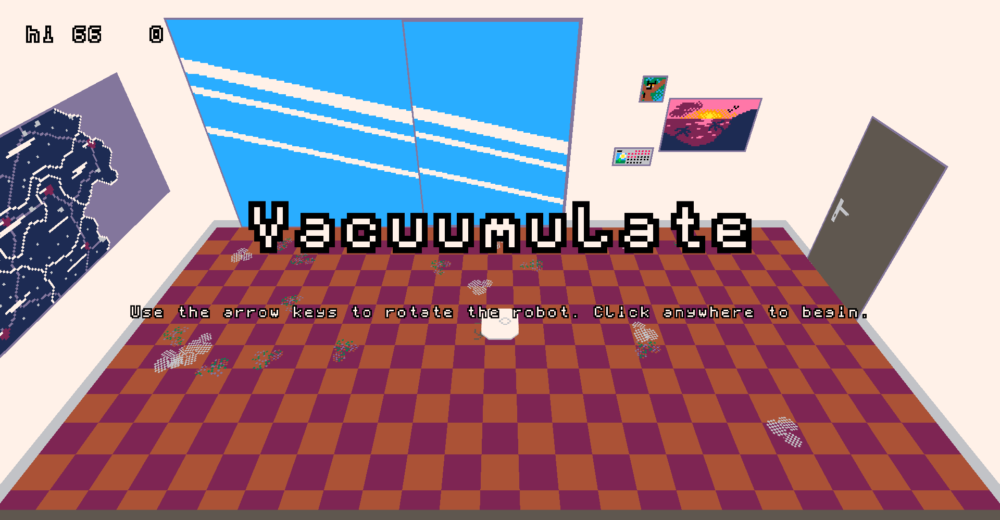
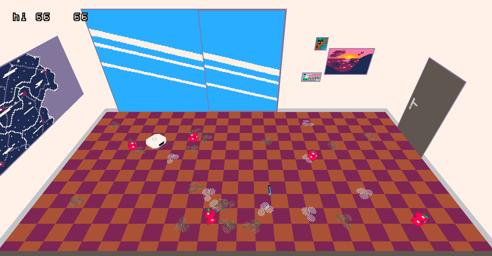

# Vacuumulate

Vacuumulate is a small browser game written in a few days using [the Gera programming language](https://github.com/geralang) and the [the Obem game library](https://github.com/typesafeschwalbe/obem).

The game is about a small vacuum robot that needs to clean up a room.

The project may be compiled from source using [the Gera package manager](https://github.com/geralang/gerap), but you can also simply play the game over at https://vaccumulate.netlify.app/.

### Credits

- 3D models and textures: TypeSafeSchwalbe (me)
- Sound effects: https://pixabay.com
- Background music: Kevin MacLeod - "Backbay Lounge"